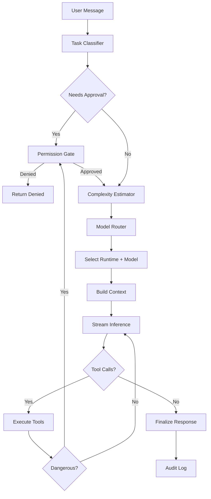

# Monillegence AI — Agent Workflows

## Workflow Overview



## Agent Types

### CodingAgent

- **Tasks**: file generation, edits, refactors
- **Default tier**: medium
- **Tools**: `read_file`, `write_file`, `search_repo`, `list_dir`

### DebugAgent

- **Tasks**: error analysis, stack trace interpretation, fix suggestions
- **Default tier**: large
- **Tools**: `read_file`, `run_tests`, `terminal_execute` (approved)

### DeployAgent

- **Tasks**: Docker, Vercel, Railway, Render scaffolding
- **Default tier**: large
- **Tools**: `terminal_execute`, `write_file`, `deploy_preview`
- **Always requires approval** for deploy actions

### ChatAgent

- **Tasks**: general Q&A, explanations
- **Default tier**: small/medium based on complexity
- **Tools**: optional read-only file access

## Workflow Engine

Modular orchestration (LangGraph-inspired, implemented in TypeScript):

```typescript
interface WorkflowStep {
  name: string;
  execute(ctx: AgentContext): Promise<StepResult>;
  onError?: (err: Error, ctx: AgentContext) => Promise<StepResult>;
}

interface AgentWorkflow {
  id: string;
  steps: WorkflowStep[];
}
```

### Example: Multi-File Refactor

1. **Analyze** — Scan repo, identify affected files (medium model)
2. **Plan** — Generate refactor plan (large model if >5 files)
3. **Approve** — Show diff preview, request write permission
4. **Execute** — Apply changes with snapshots for rollback
5. **Verify** — Run linter/tests if available
6. **Report** — Summarize changes (small model)

## Streaming Protocol (WebSocket)

```json
// Client → Server
{ "type": "chat", "message": "...", "taskType": "refactor", "context": { "files": ["src/a.ts"] } }

// Server → Client
{ "type": "routing", "decision": { "modelId": "qwen2.5-coder:7b", "tier": "medium" } }
{ "type": "token", "content": "Here" }
{ "type": "token", "content": " is" }
{ "type": "permission_request", "request": { "id": "...", "action": "file_write", ... } }
{ "type": "tool_call", "tool": "write_file", "args": { "path": "..." } }
{ "type": "done", "messageId": "..." }
{ "type": "error", "message": "..." }
```

## Task Complexity Heuristics

| Signal | Weight |
|--------|--------|
| Message length > 500 chars | +1 |
| Mentions "architecture", "design", "debug" | +2 |
| Multiple files in context | +1 per file (max 3) |
| Code block in prompt | +1 |
| Deployment keywords | +2 |
| Stack trace present | +2 |
| User selected "deep reasoning" | +3 |

Score → tier mapping: 0-2 trivial/small, 3-5 medium, 6+ large.
