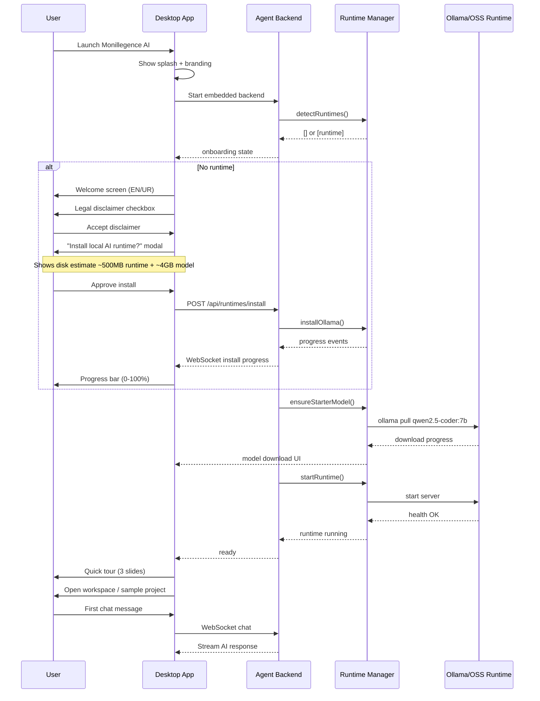

# Monillegence AI — Onboarding Flow

## First Launch Sequence

## Onboarding Screens

### 1. Welcome

- Logo + tagline: **"Pakistan's AI-native software engineering platform"**
- Language toggle: English | اردو
- CTA: "Get Started"

### 2. Legal Disclaimer

> AI-generated code may contain bugs, vulnerabilities, or incorrect logic. Review outputs before production use.

- Required checkbox before continue

### 3. Runtime Setup

- Auto-detect result badge (found / not found)
- If not found:
  - Recommended: Ollama (one-click)
  - Alternative: LM Studio
  - Disk space required
  - "Install & Continue" / "Skip (limited mode)"

### 4. Starter Model

- Pre-selected: **Qwen2.5-Coder 7B**
- Show RAM/VRAM requirements
- Download progress with pause/cancel
- "Suggest stronger models later" note

### 5. Ready

- Runtime status: green
- Model loaded: checkmark
- CTA: "Open Monillegence AI"

## Ongoing Onboarding Hints

- Empty chat: suggested prompts in EN/UR
- First refactor: tooltip about approval flow
- Settings link for model manager

## Skip / Limited Mode

If user skips runtime install:

- UI works in "cloud-ready" stub mode
- Chat disabled with banner: "Install local runtime to enable AI"
- Model manager shows install CTA
- No cloud fallback without explicit future opt-in

## Localization (Urdu)

Key strings stored in `packages/ui/src/i18n/ur.json`:

- Welcome title: "Monillegence AI میں خوش آمدید"
- Install prompt: "مقامی AI رن ٹائم انسٹال کریں"
- Legal disclaimer: full Urdu translation

## PKR Pricing (Future-Ready)

Onboarding stores region default `PK` in config. Pricing UI placeholder in settings for Pro tier (PKR/month) — payment integration stub only.
