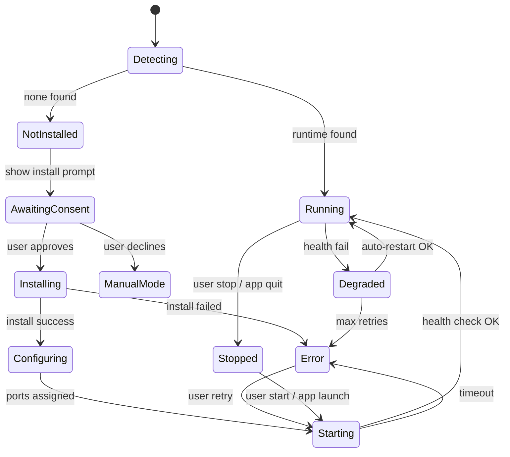

# Monillegence AI — Runtime Lifecycle

## State Machine



## Lifecycle Phases

### 1. Detection

On app start and every 60s (configurable):

1. Probe known ports: Ollama `11434`, LM Studio `1234`, llama.cpp `8080`.
2. Run `which ollama` / check `%LOCALAPPDATA%/Programs/lm-studio`.
3. Emit `runtime:detected` or `runtime:missing` events.

### 2. Installation (with consent)

**Ollama (primary on Windows):**

1. Download installer from `ollama.com/download`.
2. Silent install to user scope.
3. Verify `ollama --version`.

**LM Studio (llmster):**

1. Download headless CLI bundle.
2. Extract to `%APPDATA%/MonillegenceAI/runtimes/lmstudio`.
3. Register path in config.

### 3. Configuration

- Assign ports (avoid conflicts).
- Write `config.json` with `baseUrl`, `preferredRuntime`.
- Set `OLLAMA_HOST=127.0.0.1:{port}` if needed.

### 4. Model Bootstrap

1. Check if starter model exists locally.
2. If not, `ollama pull qwen2.5-coder:7b` (or equivalent).
3. Track progress via download events.
4. Mark `starterModelInstalled: true`.

### 5. Server Start

```typescript
// Pseudocode
async function startRuntime(runtime: RuntimeType): Promise<RuntimeInstance> {
  const adapter = adapterRegistry.get(runtime);
  await adapter.start({ port, host: '127.0.0.1' });
  await waitForHealth(adapter, { timeoutMs: 30000, intervalMs: 500 });
  return adapter.getInstance();
}
```

### 6. Health Monitoring

Every 10s while app is focused:

- `GET /api/tags` (Ollama) or `GET /v1/models` (OpenAI-compat).
- On failure: increment retry counter.
- After 3 failures: restart runtime process.
- After 3 restart failures: set status `error`, notify UI.

### 7. Shutdown

On app quit:

1. Graceful stop (SIGTERM to child process).
2. Optional: keep Ollama running (user setting).
3. Flush audit log and config.

## Multi-Runtime Strategy

| Priority | Runtime | Use Case |
|----------|---------|----------|
| 1 | Ollama | Default; easiest auto-install on Windows |
| 2 | LM Studio | Fallback if Ollama unavailable |
| 3 | llama.cpp server | Advanced users, custom builds |
| 4 | vLLM | Future; multi-GPU servers |

Only one primary runtime runs by default; large models may spawn secondary instance on different port when VRAM allows.
